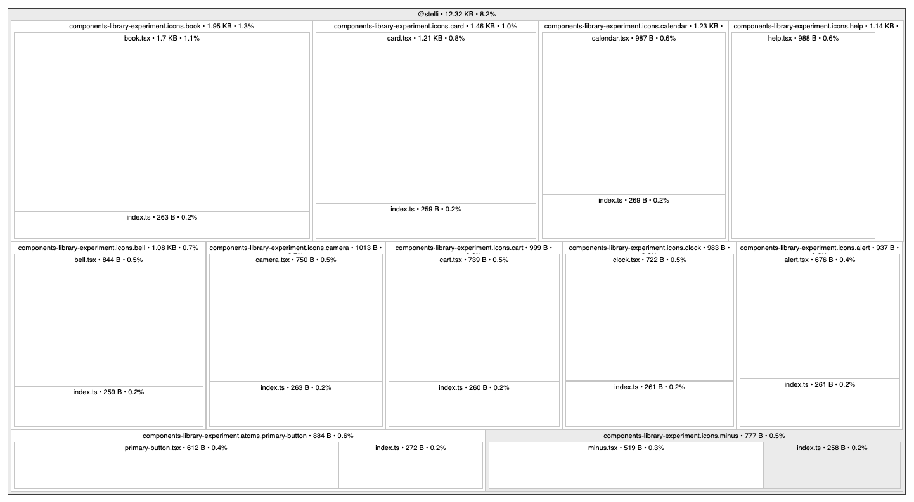
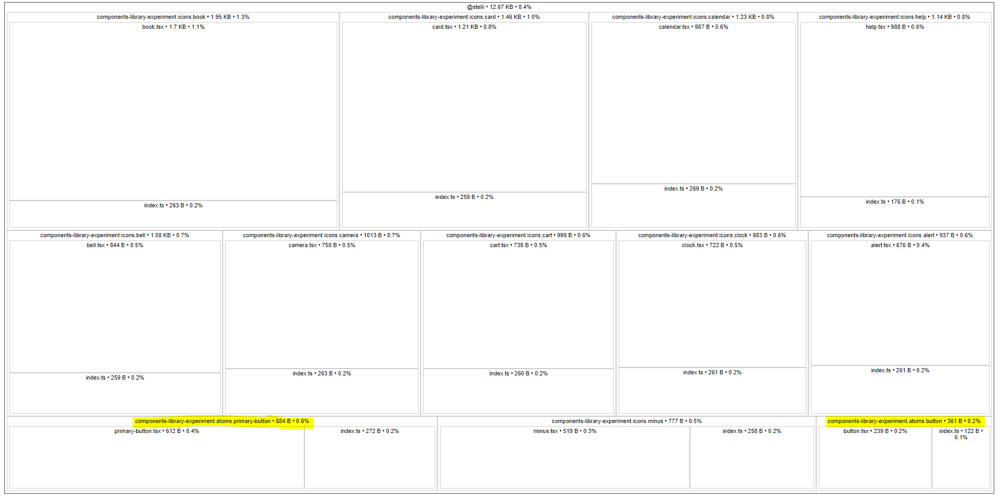
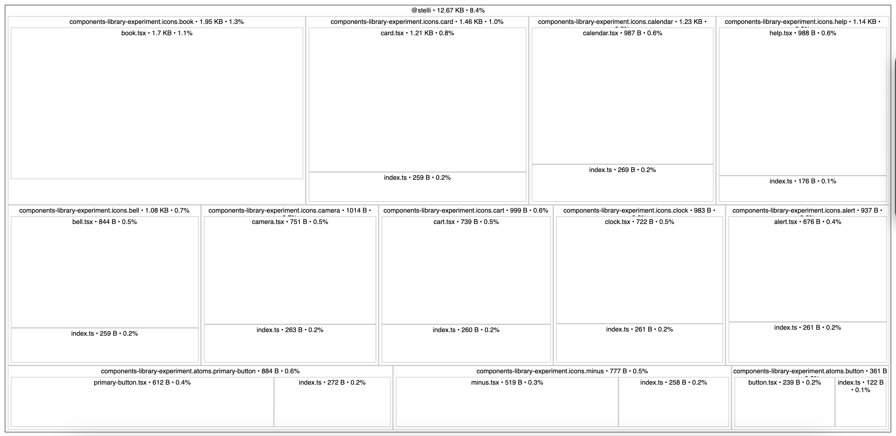

# Experiment using bit components and CRA

This is am experiment to test the usage of bit components with CRA and the impact on the bundle size depending on the strategy used to build the bit components.

## Using component with no direct the dependencies to others

With this strategy the bundle produced on this app resulted in a file containing 350 bytes.

## Using component with direct the dependencies to others

This version increased the bundle size to 12.32 kilo bytes, as it has inside the dependencies to other components.

## Using both components with and without direct dependencies to others

This version increased the bundle size to 12.67 kilo bytes, due to the new button component but nothing increased from the icon

## Using peer dependencies

This version has exaclty the same bundle size than the previous one

